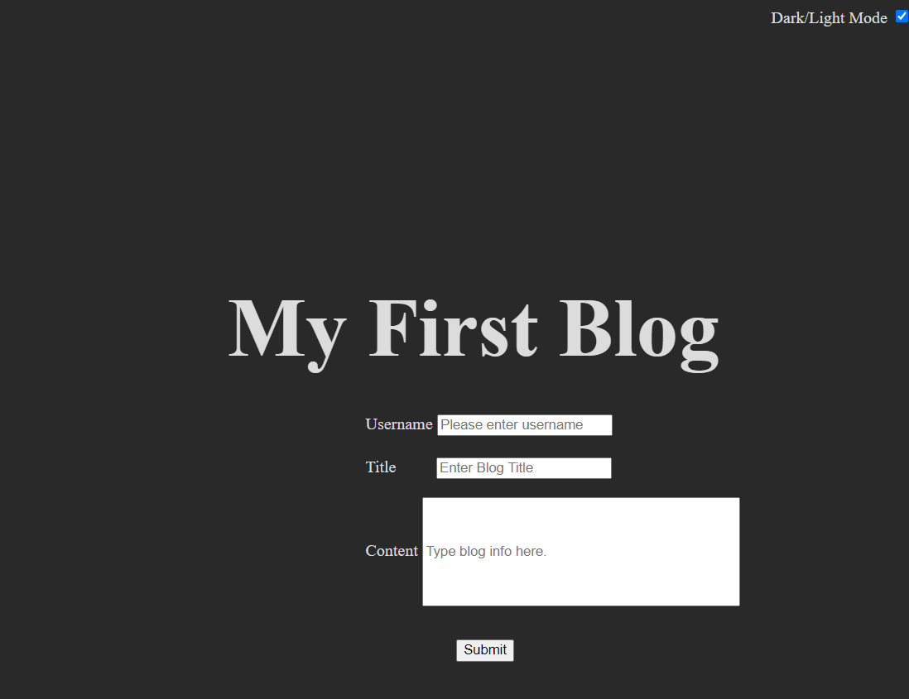
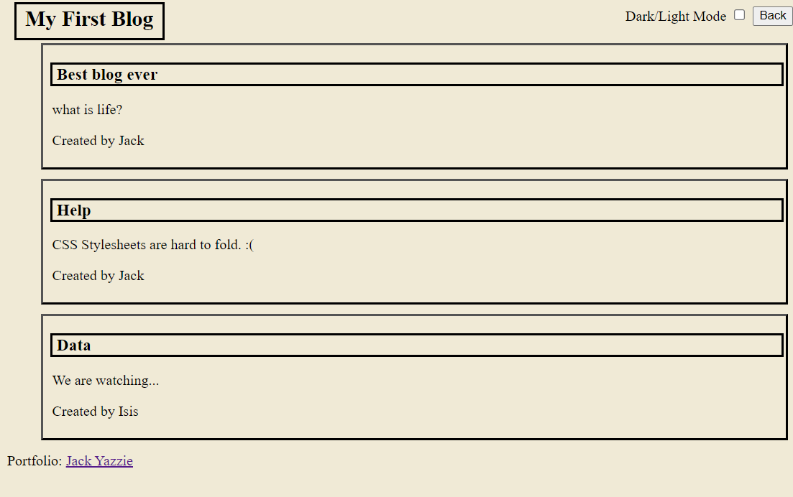

# Week 4 Challenge Personal Blog

A blog page to show how filling out a form and storing data in local storage can be pulled by another page in order to populate it with elements. 

## Resources

Xpert Learning Assistant. (2024, March 22nd) https://bootcampspot.instructure.com/courses/5271/external_tools/313